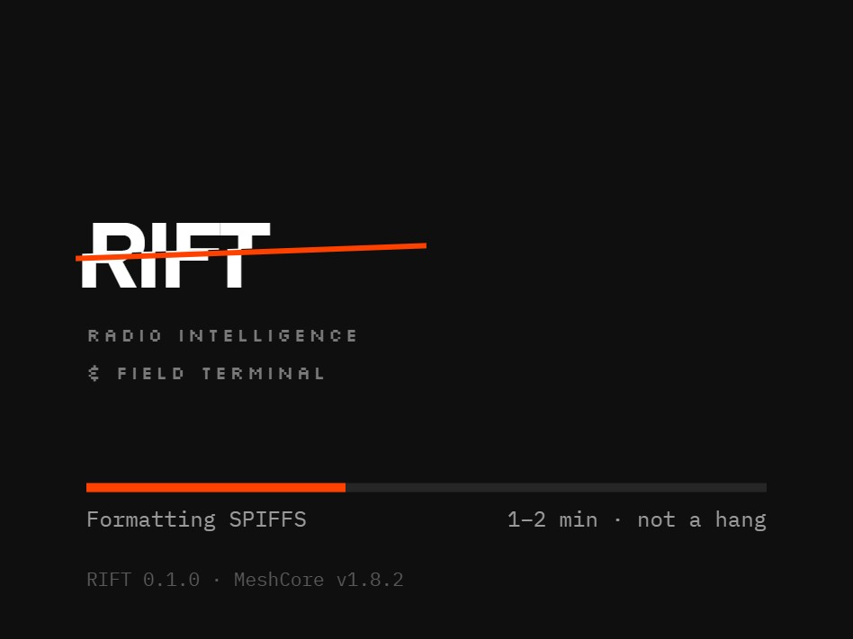
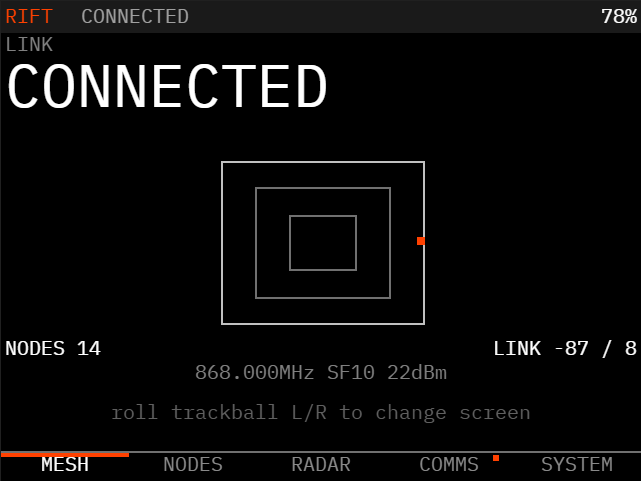
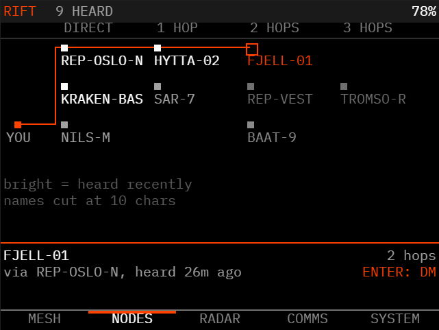
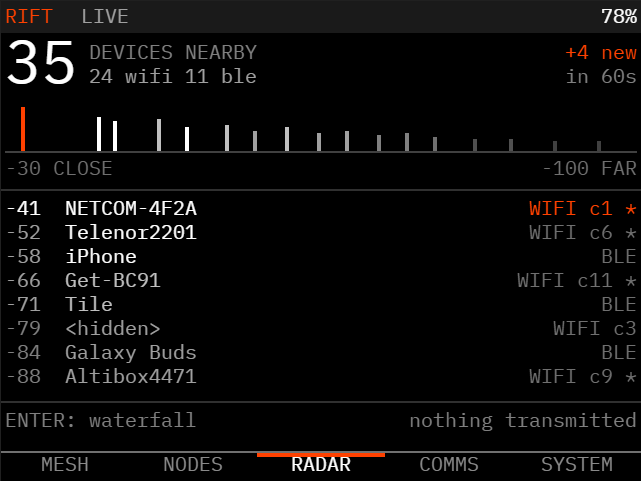
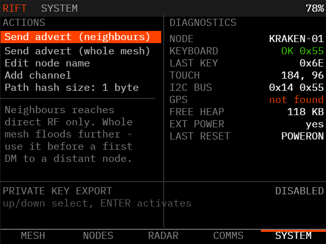
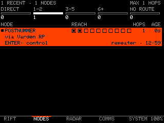
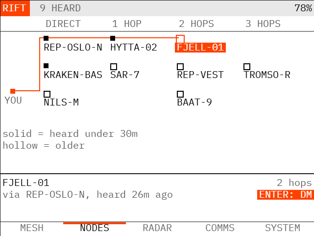

# RIFT — Radio Intelligence & Field Terminal

A custom firmware UI for the **original LilyGO T-Deck**, built on
[**MeshCore**](https://github.com/meshcore-dev/MeshCore) by
**Scott Powell** ([rippleradios.com](https://rippleradios.com)) and the MeshCore
contributors.

> RIFT is only a user interface. Every part that makes the radio work — the mesh
> protocol, routing, encryption, the SX1262 and RadioLib integration, the board
> support — is MeshCore's work, used unmodified. All credit for that belongs
> upstream. If MeshCore is useful to you, support it:
> [buymeacoffee.com/ripplebiz](https://buymeacoffee.com/ripplebiz) ·
> [Discord](https://meshcore.gg) · [docs.meshcore.io](https://docs.meshcore.io)

RIFT turns the T-Deck into a standalone mesh terminal: read and write MeshCore
messages using the physical keyboard, with no phone or companion app involved,
plus passive Wi-Fi/BLE situational awareness and a view of the mesh topology.

Upstream's on-device UI is a status display — it shows an unread count and
previews incoming messages, but cannot compose. Writing a message normally means
pairing the node to a MeshCore client over BLE, USB or Wi-Fi: the
[web app](https://app.meshcore.nz),
[Android](https://play.google.com/store/apps/details?id=com.liamcottle.meshcore.android)
or [iOS](https://apps.apple.com/us/app/meshcore/id6742354151) apps, or
[meshcore-cli](https://github.com/fdlamotte/meshcore-cli). RIFT replaces the
on-device UI with one built around the keyboard the T-Deck already has, so no
second device is needed.

<p align="center">

</p>
<p align="center">
<sub>The boot screen. The status line appears only when SPIFFS actually needs
formatting, which takes one to two minutes.</sub>
</p>

---

## Contents

- [Flashing a device](#flashing-a-device) — start here
- [Hardware](#hardware)
- [Screens and controls](#screens-and-controls)
- [Sending your first direct message](#sending-your-first-direct-message)
- [How this was built](#how-this-was-built)
- [Known limitations](#known-limitations)
- [Status](#status)
- [Upstream MeshCore](#upstream-meshcore)

Other documents in this repository:

| File | What |
|---|---|
| [`BUILDING.md`](BUILDING.md) | Toolchain, environment traps, commands, CI, supply chain |
| [`ARCHITECTURE.md`](ARCHITECTURE.md) | How RIFT fits together, and why each awkward part is that way |
| [`HANDOFF.md`](HANDOFF.md) | Working notes — hardware facts, protocol details, open items |
| [`design/handoff.md`](design/handoff.md) | Screen design spec at 1:1 device coordinates |

---

## Flashing a device

### → [**krakensaten.github.io/RIFT**](https://krakensaten.github.io/RIFT/) ←

**The browser flasher. Nothing to install.** Plug the T-Deck in, press the button,
done. **Chrome or Edge on desktop only** —
it uses [ESP Web Tools](https://esphome.github.io/esp-web-tools/) over WebSerial,
which Firefox and Safari do not implement.

The page is built and published by `rift-release.yml` on every `v*` tag, from the
same binary attached to the release, so it cannot drift out of step.

### Or by hand

With the `*-merged.bin` from the
[releases page](https://github.com/KrakenSaten/RIFT/releases):

```bash
python -m esptool --chip esp32s3 --port COM5 write-flash 0x0 rift-merged.bin
```

Those are esptool 5 command names; esptool 4, which PlatformIO bundles, uses
`write_flash`. Going through `python -m esptool` works on both.

Building from source instead? See [`BUILDING.md`](BUILDING.md).

### Before you flash — two things worth knowing

<details>
<summary><strong>Your identity survives an upgrade, but not a chip erase</strong></summary>

The merged image spans offset 0 to roughly `0x19d000` — bootloader, partition
table, boot selector, application. The SPIFFS partition holding the MeshCore
private key sits at `0xc90000`, well past that, so flashing in place keeps your
identity, contacts and channels. NVS at `0x9000` does fall inside the image and is
erased, but that holds Arduino-side preferences rather than anything MeshCore
needs.

A **full chip erase is a different matter**: it takes SPIFFS with it, and since
RIFT disables MeshCore's private-key export there is no way to back the key up
first or recover it after. Only erase if you intend to become a new node.

**The browser flasher asks before erasing, and it has to.** ESP Web Tools erases
all data by default on what it considers a new install, and it decides that by
asking the device to identify itself over Improv Serial. RIFT does not implement
Improv, so it can never answer — meaning every install would be classed as new and
would wipe the identity, every time. The manifest therefore sets
`new_install_prompt_erase`, which turns that into a question rather than a default.
**Answer no when upgrading a node you already use.**

</details>

<details>
<summary><strong>A first boot on an unformatted partition takes one to two minutes</strong></summary>

The boot screen says so in as many words, because an unexplained pause on a device
with no obvious activity is indistinguishable from a brick — and resetting partway
through leaves the filesystem needing another format anyway.

The line only appears when a format is really about to happen. `SPIFFS.begin()`
formats on mount failure, so RIFT probes first with `formatOnFail` off; a normal
boot mounts immediately and shows nothing.

**There is no progress bar**, despite the design: that format blocks the only
running task for its full duration — `loop()` has not started and the UI task does
not yet exist — and it reports no progress along the way. A bar would either sit
frozen or animate against a guess, and both are worse than a sentence that tells
the truth.

</details>

---

## Hardware

Original LilyGO T-Deck — **not** T-Deck Pro:

- ESP32-S3, 16 MB flash, 8 MB PSRAM
- SX1262 LoRa
- 320×240 ST7789 colour LCD
- Physical QWERTY keyboard (I²C co-processor at `0x55`)
- Trackball (4 directional lines + centre click)
- GT911 capacitive touchscreen at I²C `0x14`
- GPS is optional and varies by unit — the firmware probes for a receiver on
  GPIO43/44 at boot, and SYSTEM reports whether one was found

---

## Screens and controls

Five screens, reached from a nav bar along the bottom. The first is labelled
**RIFT** and is the home screen; the wordmark doubles as the home tab.

<table>
<tr>
<td width="50%"></td>
<td width="50%"></td>
</tr>
<tr>
<td><strong>RIFT</strong> — is the mesh alive around me</td>
<td><strong>NODES</strong> — who I can reach, and how far away</td>
</tr>
<tr>
<td></td>
<td></td>
</tr>
<tr>
<td><strong>RADAR</strong> — is there anything around me, and is that changing</td>
<td><strong>SYSTEM</strong> — actions left, read-only diagnostics right</td>
</tr>
</table>

<table>
<tr>
<td width="50%"></td>
<td width="50%"></td>
</tr>
<tr>
<td colspan="2"><strong>Night and day</strong> — the same geometry with a swapped colour table, toggled from SYSTEM. The accent is the same value in both, but on white it becomes a fill with the text reversed out of it rather than text in its own right.</td>
</tr>
</table>

> These are design renderings from `design/`, drawn at 1:1 device resolution and
> shown at 2x — not photographs of the panel. The firmware has since moved past
> them in a few places, all deliberate: **there is no longer a title bar across
> the top** — the wordmark and battery live in the nav bar and each screen carries
> its own heading — the home screen headlines mesh receive activity rather than the
> companion link, the SYSTEM menu carries a sixth item for day mode, the
> diagnostics column has two extra rows for boot timings, and the wordmark is
> drawn as `setTextSize(3)` text because a 1-bit bitmap would need hand-pixelling
> first.

**Trackball click is Enter** — it selects, activates and sends, the same as the
keyboard's Enter. Screen changes are covered by **rolling the trackball
left/right**, **double-click** (previous screen), or **tapping a nav-bar tab**.
**Backspace** goes one level back out of any sub-view.

| Screen | What it shows | Screen-specific controls |
|---|---|---|
| **RIFT** | Whether the mesh is alive: `ACTIVE` / `IDLE` / `QUIET` / `NO SIGNAL` set large, with how long ago the radio last decoded anything and how many packets it has heard. Plus node count, link RSSI/SNR, radio config, and the USB/BLE companion link, labelled for what it actually measures | — |
| **NODES** | Who you can reach and how far away, as four hop columns. Filled marker = heard in the last 30 minutes, hollow = older. The selected node's route is drawn through the repeaters it actually travelled | trackball up/down selects a node, or tap one; **Enter** starts a DM to it |
| **RADAR** | Passive Wi-Fi + BLE. Device count, how many are new in the last 60s, three signal-strength bands with one cell per device, and the strongest-first list | **Enter** toggles the waterfall; up/down scrolls the list |
| **COMMS** | MeshCore text terminal — channel strip, message history, compose line with a character count | **tap a channel** to switch to it; **Enter** sends, or opens the target picker when the line is empty; **backspace** deletes; up/down scrolls history |
| **SYSTEM** | Actions left of the divider, read-only diagnostics right of it: node name, keyboard, last key, I²C bus, touch, GPS, free heap, external power, last reset, boot timings | up/down or tap selects; **Enter** activates. Actions: send advert (two kinds), edit node name, add channel, path hash size, day/night |

**An incoming message raises a panel** over whatever you are doing, listing the six
newest with sender and time. **Enter** opens COMMS for the full history;
**backspace** dismisses it and hands back the screen you were on. It does not
interrupt you mid-compose, or while a one-time channel key is on screen.

**Long-press the trackball within 8 seconds of boot** to enter MeshCore's CLI
rescue mode (upstream behaviour, preserved).

### Sending your first direct message

A recipient cannot decrypt a direct message from a node it has never heard an
advert from — it looks the sender up in its contacts and silently drops the packet.
So **send an advert from SYSTEM first**, and confirm the T-Deck appears in the other
node's contact list. Public-channel messages work without this, because channels use
a shared key.

Configured channels appear as a strip across the top of COMMS — tap one to switch
to it, with the active channel filled. Contacts are not in the strip (there can be
many); press Enter on an empty line for the full picker, which lists every channel
(marked `channel`) followed by contacts, most recently heard first (marked
`direct`). Repeaters and sensors are filtered out — nobody is reading them. When a
contact is the target, the strip shows `DM` and the contact's name sits above it.

Direct messages show delivery state (`...` → `ACK 1.2s`, or `no ack` on timeout).
Channel messages show none: they are always flooded and carry no acknowledgement,
so there is nothing truthful to display.

---

## How this was built

The RIFT code in this fork was written by an AI assistant (Claude), directed and
supervised by **mstr** ([KrakenSaten](https://github.com/KrakenSaten)), who
specified the work, tested every change and is accountable for what ships here.

That supervision is not a formality. The AI cannot flash a board or watch a radio,
so nothing was accepted on the strength of "it compiles" — each change was flashed
to physical hardware and verified before being committed. Several things the AI got
wrong were caught exactly there:

- it used a USB API that only reports true once a host *opens* the serial port, so
  "keep the display on while charging" silently never worked
- it parsed the touch controller using the datasheet's byte layout instead of the
  one the hardware actually returns, giving impossible coordinates
- it assumed keyboard and trackball pin behaviour that the hardware contradicted,
  three separate times
- it assumed a key that emits nothing could host a feature, until the raw byte was
  put on screen and disproved it
- it wrote documentation stating as fact things this device disproves

Where its assumptions and the hardware disagreed, the hardware won — and the
diagnostics on the SYSTEM screen exist because of it.

**MeshCore itself is not AI-written.** The protocol, routing, encryption and radio
drivers are the upstream project's work by human authors; see the credit above.

---

## Known limitations

Honest list. Each of these is a deliberate trade-off, not an oversight.
[`ARCHITECTURE.md`](ARCHITECTURE.md) has the reasoning behind the first two.

**BLE is never de-initialised.** `BLEDevice::deinit()` panics in this ESP32 Arduino
core when a scan has recently been active. After the first visit to RADAR the BLE
stack stays initialised and idle until reboot, holding its heap. It transmits
nothing in that state.

**Message history is RAM-only** and does not survive a reboot. MeshCore stores no
messages itself, so this would mean new persistence code and flash wear. The log
holds the 48 most recent messages, each up to the full MeshCore text length of 160
characters.

**Nordic characters can be read but not typed.** Incoming UTF-8 is mapped to CP437,
which carries æ Æ å Å ä Ä ö Ö; ø and Ø are absent from the font and are drawn as
the base letter plus a stroke. Input is a different problem: the keyboard is a US
QWERTY with no Nordic keys, and `SYM` is a working symbol layer rather than a spare
key, so entering them needs a compose scheme. Not implemented — reading was the part
that actually hurt.

**Emoji are approximated or shown as a block.** Invisible code points are dropped
and consecutive unmappable ones collapse to one block, so a heart with a variation
selector is one glyph rather than two squares and a ZWJ family is one rather than
five. Where a genuine equivalent exists it is used — hearts, notes, suits, arrows,
and ASCII emoticons for the unambiguous faces. Everything else stays a block on
purpose: CP437 has no emoji, and putting a smile where someone sent a sobbing face
would be worse than admitting the glyph is missing.

**The COMMS target picker holds 48 entries.** Configured channels are listed first
so they are never crowded out, then contacts most-recently-heard first. If contacts
had to be cut the picker says so rather than hiding them silently — but a node that
has heard from more than ~40 chat contacts cannot reach all of them from that list.

**RADAR data is cleared when you leave the screen.** Stale channel occupancy
presented as current would be actively misleading.

**The waterfall is not a spectrum analyser.** The ESP32 gives no access to raw RF.
What is plotted is observed 802.11 activity — the strongest signal seen per channel,
one row per sweep.

**No per-node signal strength in NODES.** Adverts are cached without RSSI, so the
screen shows hop distance and recency — a filled marker for heard in the last 30
minutes, hollow for older — rather than link quality. Freshness is deliberately
carried by shape rather than by a grey level: reflected light outdoors lays a veil
over the panel and the darker steps of a grey ramp collapse into each other.

**Keyboard arrow keys are unreachable.** `TDeckKeyboard` discards bytes above 127,
which is where the arrow codes live. The trackball provides directions instead, so
this has not mattered in practice.

**Uploading over USB may need two writes.** A single `pio run -t upload` fails
reproducibly partway through on this device; see [`BUILDING.md`](BUILDING.md). The
browser flasher is unaffected.

**An upstream bug is worked around here**, not fixed: the RTC probe leaves the I²C
bus unusable, which cost 243 seconds of boot until the bus was restarted after it.
Boot is now 5.1 seconds. Why the probe does that is still not established — see
[`ARCHITECTURE.md`](ARCHITECTURE.md).

---

## Status

**Current release: 0.3.1** — set by the `RIFT_VERSION` build flag and shown on the
boot screen and SYSTEM, alongside the MeshCore version it is built on. Deliberately
0.x: it works and is verified on hardware, but it has had no external users and the
limitations above are real.

`FIRMWARE_VERSION` is left as upstream MeshCore's, since that string is reported
over the companion protocol next to `FIRMWARE_VER_CODE`.

Every screen from the original design concept is implemented and verified on
physical hardware. Resource use: ~50 % of internal static RAM, ~25 % of the 6.5 MB
app partition. 91 native tests.

**Unreleased, on the `rift-mesh-activity` branch** pending review and merge — so
this is not in 0.3.1 and not yet on `rift-tdeck`. All verified on hardware: the home screen now
headlines mesh receive activity instead of the USB/BLE link; screens gained a
lifecycle so a popup no longer disturbs a RADAR scan or wipes a channel key being
read; the message popup lists six rather than paging one at a time; incoming emoji
no longer arrive as runs of blocks; and the title bar was removed, moving the
wordmark and battery into the nav bar.

Earlier: 0.3.1 closed a stack overflow in the channel-key decoder and seven places
where the interface stated something it could not know. 0.3.0 rebuilt all five
screens to the design in `design/` and fixed four real bugs found along the way.
0.2.0 added the browser flasher and the boot screen, disabled MeshCore's private-key
export, and took boot from 243 seconds to 5.1.

Next, roughly by value:

- A compose scheme for typing Nordic characters — long-pressing the base vowel,
  which also needs the compose line to become UTF-8 aware
- Persist message history across reboots
- Report the `Wire.begin()` ordering bug upstream
- Hand-drawn glyphs for the emoji that still show as a block
- Per-contact detail view (paths, keys, last-heard history)

[`HANDOFF.md`](HANDOFF.md) carries the full open-items list with the reasoning.

---

## Upstream MeshCore

RIFT is a fork of [MeshCore](https://github.com/meshcore-dev/MeshCore), created by
**Scott Powell** (rippleradios.com) and developed with contributions from well over
a hundred people — see the
[contributor list](https://github.com/meshcore-dev/MeshCore/graphs/contributors).
MIT licensed; `license.txt` is unchanged.

To be clear about the split: MeshCore is the hard part. Multi-hop routing, the
packet protocol, encryption, ACK handling, path discovery, the radio drivers and
support for dozens of boards are all theirs, and RIFT changes none of it. What this
fork adds is a T-Deck-specific user interface and its input drivers.

If you are looking for MeshCore itself, go upstream. It supports far more hardware,
has prebuilt firmware and a web flasher, and actual releases:

- Project: <https://github.com/meshcore-dev/MeshCore>
- Documentation: <https://docs.meshcore.io>
- Flasher: <https://meshcore.io/flasher>
- Community: <https://meshcore.gg>
- Support the work: <https://buymeacoffee.com/ripplebiz>

The rest of this repository is upstream's tree: other boards, the repeater and
room-server examples, the companion protocol, and so on. Useful references:

- [`docs/MeshCore-README.md`](docs/MeshCore-README.md) — upstream's own README:
  prebuilt firmware, the flasher, client apps, and their roadmap
- [`docs/companion_protocol.md`](docs/companion_protocol.md) — frame protocol, and
  the channel key definitions RIFT follows
- [`docs/faq.md`](docs/faq.md) — MeshCore questions unrelated to RIFT

If you want plain MeshCore rather than RIFT, get it from upstream — this fork only
adds a T-Deck UI and does not track their releases.
