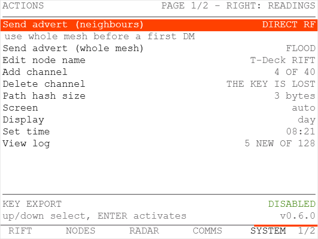
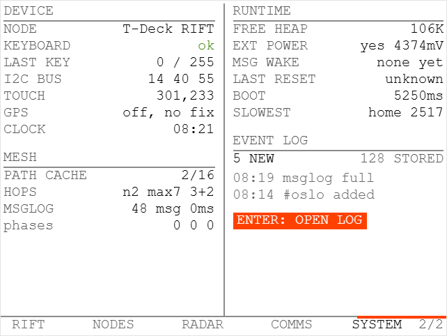

# RIFT — Radio Intelligence & Field Terminal

A custom firmware UI for the **original LilyGO T-Deck**, built on
[**MeshCore**](https://github.com/meshcore-dev/MeshCore) by
**Scott Powell** ([rippleradios.com](https://rippleradios.com)) and the MeshCore
contributors.

> RIFT is only a user interface. Every part that makes the radio work — the mesh
> protocol, routing, encryption, the SX1262 and RadioLib integration, the board
> support — is MeshCore's work, used unmodified. All credit for that belongs
> upstream. If MeshCore is useful to you, support it:
> [buymeacoffee.com/ripplebiz](https://buymeacoffee.com/ripplebiz) ·
> [Discord](https://meshcore.gg) · [docs.meshcore.io](https://docs.meshcore.io)

RIFT turns the T-Deck into a standalone mesh terminal: read and write MeshCore
messages using the physical keyboard, with no phone or companion app involved,
plus passive Wi-Fi/BLE situational awareness, a view of the mesh topology, and
enough repeater administration to log in, read a repeater's stats and telemetry
and run a command on it from the device itself.

**Free, and it will never cost anything.** No licence fee, no paid tier, no
unlocked features, now or later. That is not only an intention: RIFT is MIT
licensed, and an MIT grant cannot be withdrawn from anything already published — so
every version you can download stays free to use, modify and redistribute even if
this repository disappears tomorrow. The same licence lets anyone else sell or
rebrand it, which is the price of it being genuinely open, and is fine.

If you want to send money somewhere, send it
[upstream](https://buymeacoffee.com/ripplebiz) — MeshCore is the hard part.

Upstream's on-device UI is a status display — it shows an unread count and
previews incoming messages, but cannot compose. Writing a message normally means
pairing the node to a MeshCore client over BLE, USB or Wi-Fi: the
[web app](https://app.meshcore.nz),
[Android](https://play.google.com/store/apps/details?id=com.liamcottle.meshcore.android)
or [iOS](https://apps.apple.com/us/app/meshcore/id6742354151) apps, or
[meshcore-cli](https://github.com/fdlamotte/meshcore-cli). RIFT replaces the
on-device UI with one built around the keyboard the T-Deck already has, so no
second device is needed.

<p align="center">

</p>
<p align="center">
<sub>The boot screen. The status line appears only when SPIFFS actually needs
formatting, which takes one to two minutes.</sub>
</p>

---

## Contents

GitHub renders an outline for this page; the other documents are:

| File | What |
|---|---|
| [`BUILDING.md`](BUILDING.md) | Toolchain, environment traps, commands, CI |
| [`ARCHITECTURE.md`](ARCHITECTURE.md) | How it fits together, and why each awkward part is that way |
| [`HANDOFF.md`](HANDOFF.md) | What the code does not say: measurements, protocol facts, open items |
| [`design/DESIGN-REVIEW-2026-09.md`](design/DESIGN-REVIEW-2026-09.md) | Current design reference — measured palette, the RGB565 constraint, what is still open |
| [`design/DESIGN-HANDOFF.md`](design/DESIGN-HANDOFF.md) | The original handoff it grew out of |

---

## Flashing a device

### → [**krakensaten.github.io/RIFT**](https://krakensaten.github.io/RIFT/) ←

**The browser flasher. Nothing to install.** Plug the T-Deck in, press the button,
done. **Chrome or Edge on desktop only** —
it uses [ESP Web Tools](https://esphome.github.io/esp-web-tools/) over WebSerial,
which Firefox and Safari do not implement.

The page is built and published by `rift-release.yml` on every `v*` tag, from the
same binary attached to the release, so it cannot drift out of step.

### Or by hand

With the `*-merged.bin` from the
[releases page](https://github.com/KrakenSaten/RIFT/releases):

```bash
python -m esptool --chip esp32s3 --port COM5 write-flash 0x0 rift-merged.bin
```

Those are esptool 5 command names; esptool 4, which PlatformIO bundles, uses
`write_flash`. Going through `python -m esptool` works on both.

Building from source instead? See [`BUILDING.md`](BUILDING.md).

### Before you flash — two things worth knowing

<details>
<summary><strong>Your identity survives an upgrade, but not a chip erase</strong></summary>

The merged image spans offset 0 to roughly `0x19d000` — bootloader, partition
table, boot selector, application. The SPIFFS partition holding the MeshCore
private key sits at `0xc90000`, well past that, so flashing in place keeps your
identity, contacts and channels. NVS at `0x9000` does fall inside the image and is
erased, but that holds Arduino-side preferences rather than anything MeshCore
needs.

A **full chip erase is a different matter**: it takes SPIFFS with it, and since
RIFT disables MeshCore's private-key export there is no way to back the key up
first or recover it after. Only erase if you intend to become a new node.

**The browser flasher asks before erasing, and it has to.** ESP Web Tools erases
all data by default on what it considers a new install, and it decides that by
asking the device to identify itself over Improv Serial. RIFT does not implement
Improv, so it can never answer — meaning every install would be classed as new and
would wipe the identity, every time. The manifest therefore sets
`new_install_prompt_erase`, which turns that into a question rather than a default.
**Answer no when upgrading a node you already use.**

</details>

<details>
<summary><strong>A first boot on an unformatted partition takes one to two minutes</strong></summary>

The boot screen says so in as many words, because an unexplained pause on a device
with no obvious activity is indistinguishable from a brick — and resetting partway
through leaves the filesystem needing another format anyway.

The line only appears when a format is really about to happen. `SPIFFS.begin()`
formats on mount failure, so RIFT probes first with `formatOnFail` off; a normal
boot mounts immediately and shows nothing.

**There is no progress bar**, despite the design: that format blocks the only
running task for its full duration — `loop()` has not started and the UI task does
not yet exist — and it reports no progress along the way. A bar would either sit
frozen or animate against a guess, and both are worse than a sentence that tells
the truth.

</details>

---

## Hardware

Original LilyGO T-Deck — **not** T-Deck Pro:

- ESP32-S3, 16 MB flash, 8 MB PSRAM
- SX1262 LoRa
- 320×240 ST7789 colour LCD
- Physical QWERTY keyboard (I²C co-processor at `0x55`)
- Trackball (4 directional lines + centre click)
- GT911 capacitive touchscreen at I²C `0x14`
- GPS is optional and varies by unit — the firmware probes for a receiver on
  GPIO43/44 at boot, and SYSTEM reports whether one was found

---

## Screens and controls

Five screens, reached from a nav bar along the bottom. The first is labelled
**RIFT** and is the home screen; the wordmark doubles as the home tab.

| Screen | What it answers |
|---|---|
| **RIFT** | Is the mesh alive around me |
| **NODES** | Who I can reach, and how far away |
| **RADAR** | Is there anything around me, and is that changing |
| **COMMS** | Conversations, channels and direct |
| **SYSTEM** | Actions on page 1, readings on page 2 |

<table>
<tr>
<td width="50%"></td>
<td width="50%"></td>
</tr>
<tr>
<td colspan="2"><strong>SYSTEM</strong> — actions on page 1, readings on page 2, trackball left and right between them. The nav bar prints the page number where the battery percentage sits on the other four screens.</td>
</tr>
</table>

> Design renderings at 1:1 device resolution, shown at 2x — not photographs of the
> panel. Only screens whose renderings match the shipping firmware are here: the
> NODES and splash renderings from the same design round differ from what is built,
> so they are left out rather than captioned. Photographs of the rest are wanted.


Night and day are the same geometry with a swapped colour table, toggled from
SYSTEM. The accent keeps its value in both, but on white it may only be a fill and
never text — 3.5:1 either way round, which is why the ink inside an accent fill is
a fixed dark value in both modes rather than white. Reversing white out of the
accent measures exactly as badly as accent text on white; that was a real bug on
thirteen surfaces until 0.9.2.


**Trackball click is Enter** — it selects, activates and sends, the same as the
keyboard's Enter. Screen changes are covered by **rolling the trackball
left/right**, **double-click** (previous screen), or **tapping a nav-bar tab**.
**Backspace** goes one level back out of any sub-view.

| Screen | What it shows | Screen-specific controls |
|---|---|---|
| **RIFT** | Whether the mesh is alive: `ACTIVE` / `IDLE` / `QUIET` / `NO SIGNAL` set large, with how long ago the radio last decoded anything and how many packets it has heard. Plus node count, link RSSI/SNR, radio config, and the USB/BLE companion link, labelled for what it actually measures. A tropo opening replaces the radio line while one is running | three buttons — `DISCOVER 0-HOP`, `ADVERT NEAR`, `ADVERT MESH` — with a line explaining the selected one. Trackball left/right chooses, **Enter** runs it |
| **NODES** | Who you can reach and how far away. Each row carries a ten-cell reach scale, filled up to the node's hop count and hollow beyond, so distance is a length compared down the column rather than a digit read per row; the exact count stays in the `HOPS` column and a route nobody knows draws ten hollow cells. Above the list, five bands — `DIRECT` `1-2` `3-5` `6+` `NO ROUTE`. Filled freshness marker = heard in the last 30 minutes, hollow = older. The selected node's route is drawn through the repeaters it actually travelled | trackball up/down or drag selects a node, or tap one; **Enter** opens what that node can do — a DM for a chat node or room, the control panel for a repeater, a reading for a sensor |
| **RADAR** | Passive Wi-Fi + BLE. Device count, how many are new in the last 60s, three signal-strength bands with one cell per device, and the strongest-first list | **Enter** toggles the waterfall; up/down scrolls the list |
| **COMMS** | MeshCore text terminal — channel strip, message history, compose line with a character count. Each row is a time, the sender's name in a colour derived from that name, and either the delivery state or the hop count. Own messages carry a 2px accent bar rather than being right-aligned, which on 320px costs two pixels instead of half the width of every line | **tap a channel** to switch to it; **Enter** sends, or opens the conversation list when the line is empty; **backspace** deletes; up/down or drag scrolls history by pixel. Each row of the list carries an unread mark, the channel's colour chip or the sender's colour, `ROOM` where it is a room server, and how long ago it last spoke |
| **SYSTEM** | Actions left of the divider, read-only diagnostics right of it: node name, keyboard, last key, I²C bus, touch, GPS, free heap, external power, last reset, boot timings, tropo baseline | up/down, drag or tap selects; **Enter** activates. Actions: edit node name, add or remove a channel, set a channel's flood scope, path hash size, day/night. The two adverts moved to the home screen in 0.9.0, where the list they affect is the screen next door |

**An incoming message raises a panel** over whatever you are doing, listing the six
newest with sender and time. **Enter** opens COMMS for the full history;
**backspace** dismisses it and hands back the screen you were on. It does not
interrupt you mid-compose, or while a one-time channel key is on screen.

**Long-press the trackball within 8 seconds of boot** to enter MeshCore's CLI
rescue mode (upstream behaviour, preserved).

### Sending your first direct message

A recipient cannot decrypt a direct message from a node it has never heard an
advert from — it looks the sender up in its contacts and silently drops the packet.
So **send an advert from SYSTEM first**, and confirm the T-Deck appears in the other
node's contact list. Public-channel messages work without this, because channels use
a shared key.

**Setting the clock.** A standalone node has nothing to set its clock from — no
companion app, no GPS fix — so SYSTEM has `Set time`, which shows the current reading
in its own menu row. The field is `YYYY-MM-DD HH:MM`.

RIFT has no timezone. Every timestamp on screen is the epoch divided down with no
offset, so **enter local time**: what you type is what message timestamps will show.
Entering UTC makes them read as UTC. An impossible date is refused rather than
corrected — February 30th does not silently become March 2nd, because you could not
see that happen — so check the field before pressing ENTER.

SYSTEM offers two kinds of advert, and the difference decides whether a distant node
ever hears you:

- **Send advert (neighbours)** reaches only nodes within direct radio range. It is
  the right one in a group standing together, and it puts nothing on the wider mesh.
- **Send advert (whole mesh)** floods, so repeaters carry it onward. This is the one
  to use before a first direct message to someone you cannot see.

If a DM is silently going nowhere, an advert that was only sent to neighbours is the
first thing to suspect.

Configured channels appear as a strip across the top of COMMS — tap one to switch
to it, with the active channel filled. Contacts are not in the strip (there can be
many); press Enter on an empty line for the full picker, which lists every channel
(marked `channel`) followed by contacts, most recently heard first (marked
`direct`). Repeaters and sensors are filtered out — nobody is reading them. When a
contact is the target, the strip shows `DM` and the contact's name sits above it.

Direct messages show delivery state (`...` → `ACK 1.2s`, or `no ack` on timeout).
Channel messages show none: they are always flooded and carry no acknowledgement,
so there is nothing truthful to display.

---

## How this was built

The RIFT code in this fork was written by an AI assistant (Claude), directed and
supervised by **mstr** ([KrakenSaten](https://github.com/KrakenSaten)), who
specified the work, tested every change and is accountable for what ships here.

That supervision is not a formality. The AI cannot flash a board or watch a radio,
so nothing was accepted on the strength of "it compiles" — each change was flashed
to physical hardware and verified before being committed. Several things the AI got
wrong were caught exactly there:

- it used a USB API that only reports true once a host *opens* the serial port, so
  "keep the display on while charging" silently never worked
- it parsed the touch controller using the datasheet's byte layout instead of the
  one the hardware actually returns, giving impossible coordinates
- it assumed keyboard and trackball pin behaviour that the hardware contradicted,
  three separate times
- it assumed a key that emits nothing could host a feature, until the raw byte was
  put on screen and disproved it
- it wrote documentation stating as fact things this device disproves

Where its assumptions and the hardware disagreed, the hardware won — and the
diagnostics on the SYSTEM screen exist because of it.

**MeshCore itself is not AI-written.** The protocol, routing, encryption and radio
drivers are the upstream project's work by human authors; see the credit above.

---

## Known limitations

Honest list. Each of these is a deliberate trade-off, not an oversight.
[`ARCHITECTURE.md`](ARCHITECTURE.md) has the reasoning behind the first two.

**BLE is never de-initialised.** `BLEDevice::deinit()` panics in this ESP32 Arduino
core when a scan has recently been active. After the first visit to RADAR the BLE
stack stays initialised and idle until reboot, holding its heap. It transmits
nothing in that state.

**Message history holds 48 messages** and is persisted to SPIFFS, so it survives a
reboot. Older messages fall off the end; MeshCore itself stores none, so nothing is
recoverable beyond what this ring holds.

**Nordic characters are typed by double-tapping a vowel** in COMMS, which opens a
picker. A long press cannot be used: this keyboard reports no key-up, so a hold is
indistinguishable from a tap. Incoming UTF-8 is mapped to CP437 for display, with
the two glyphs the font lacks synthesised by the driver.

**Emoji are approximated or shown as a block.** Invisible code points are dropped
and consecutive unmappable ones collapse to one block, so a heart with a variation
selector is one glyph rather than two squares and a ZWJ family is one rather than
five. Where a genuine equivalent exists it is used — hearts, notes, suits, arrows,
and ASCII emoticons for the unambiguous faces. Everything else stays a block on
purpose: CP437 has no emoji, and putting a smile where someone sent a sobbing face
would be worse than admitting the glyph is missing.

**The COMMS conversation list holds 96 entries.** Configured channels are listed
first so they are never crowded out, then every conversation that actually has
history, then the remaining contacts most-recently-heard first. That order matters:
being heard recently is not the same as being someone you are talking to, and
sorting only by the former once pushed an active conversation off the end of the
list entirely. If contacts have to be cut the list says so rather than hiding them
silently — and what is missing is only people you have never written to.

**RADAR data is cleared when you leave the screen.** Stale channel occupancy
presented as current would be actively misleading.

**The waterfall is not a spectrum analyser.** The ESP32 gives no access to raw RF.
What is plotted is observed 802.11 activity — the strongest signal seen per channel,
one row per sweep.

**No per-node signal strength in NODES.** Adverts are cached without RSSI, so the
screen shows hop distance and recency — a filled marker for heard in the last 30
minutes, hollow for older — rather than link quality. Freshness is deliberately
carried by shape rather than by a grey level: reflected light outdoors lays a veil
over the panel and the darker steps of a grey ramp collapse into each other.

**Keyboard arrow keys are unreachable.** `TDeckKeyboard` discards bytes above 127,
which is where the arrow codes live. The trackball provides directions instead, so
this has not mattered in practice.

**Uploading over USB needs the image split.** A long write fails part way through,
and the threshold is the transfer length rather than the flash address. Use
`tools/rift-flash.py`, which derives the split from the image size and retries a
failed chunk. The cause is still unknown — see `BUILDING.md`.

**An upstream bug is worked around here**, not fixed: the RTC probe leaves the I²C
bus unusable, which cost 243 seconds of boot until the bus was restarted after it.
Boot is now 5.1 seconds. Why the probe does that is still not established — see
[`ARCHITECTURE.md`](ARCHITECTURE.md).

---

## Status

**Current release: 0.9.2** — set by the `RIFT_VERSION` build flag and shown on the
boot screen and SYSTEM, alongside the MeshCore version it is built on. Deliberately
0.x: it works and is verified on hardware, but it has had no external users and the
limitations above are real.

`FIRMWARE_VERSION` is left as upstream MeshCore's, since that string is reported
over the companion protocol next to `FIRMWARE_VER_CODE`.

Every screen from the original design concept is implemented and verified on
physical hardware. Resource use: ~57 % of internal static RAM, ~25 % of the 6.5 MB
app partition. 256 native tests across eight suites.

Worth knowing where that RAM goes: MeshCore's contact table is `MAX_CONTACTS` 350
plus 8 anonymous slots at 184 bytes each — 65.7 KB, or a fifth of the chip's 320 KB,
statically allocated whether it holds one contact or all of them. It is the single
largest
item in the firmware.

**0.9.2** acts on a design review. The central finding was a rule that forbade
nothing: "on white the accent may only be a fill with white reversed out of it"
describes the same pair of colours in the other order, and contrast is symmetric —
so thirteen surfaces drew the selected row as the least readable row on the screen.
Also a reach scale on NODES in the 23 character cells each row was spending on
nothing, all five held-back conversation-list improvements, a nav marker that had
never sat under its own label, and a hop count COMMS was drawing twice per row. No
colour value changed: the palette was re-derived, the tables were wrong in four
ways, and `tools/palette-check.py` now generates them.

**0.9.1** rebuilds the alert audio after four faults that hid each other — the last
being that this board has no amplifier enable pin, so stopping the I²S clock sleeps
the amp — colours COMMS by sender rather than by channel, and makes the touchscreen
scroll every list.

**0.9.0** adds repeater control: log in, read the stats, ask for telemetry, run a
command from a menu rather than typing it on this keyboard. Plus a flood scope per
channel, a regions request so scopes can be discovered rather than guessed, and a
tropo detector that notices when a run of unusually deep paths says the mesh has
stretched.

**0.8.2** hardens the companion parser against six handlers that acted on bytes the
host may not have sent, and makes `rift-flash` compare the whole image against
flash before claiming success — because per-chunk hashes had reported success on a
flash the device was not running.

**0.8.1** closes all ten findings from an external code review, adds transmit rows
and a duty-cycle budget to the air log, and fixes a release pipeline that stamped the
RIFT tag as the MeshCore version.

**0.8.0** rebuilds COMMS around conversations rather than one mixed stream, adds
alert tones for messages and proximity, puts the wordmark on the RIFT screen, and
gives the home screen a discover-repeaters action.

**0.7.0** rebuilds NODES, splits SYSTEM into two pages, adds a proximity watch on
RADAR and a live RX log, and closes a bounds check on remote mesh input.

**0.6.0** colour-codes channels, adds an event log under SYSTEM, and fixes the node
data underneath NODES: the path cache evicted by wall clock, so a node whose RTC was
never set - RIFT's own case - cached exactly one neighbour however many it heard.

Release notes for every version, in full, are on the
[releases page](https://github.com/KrakenSaten/RIFT/releases). Each tag carries its
own, so they are not repeated here.

---

## Upstream MeshCore

RIFT is a fork of [MeshCore](https://github.com/meshcore-dev/MeshCore), created by
**Scott Powell** (rippleradios.com) and developed with contributions from well over
a hundred people — see the
[contributor list](https://github.com/meshcore-dev/MeshCore/graphs/contributors).
MIT licensed; `license.txt` is unchanged.

To be clear about the split: MeshCore is the hard part. Multi-hop routing, the
packet protocol, encryption, ACK handling, path discovery, the radio drivers and
support for dozens of boards are all theirs, and RIFT changes none of it. What this
fork adds is a T-Deck-specific user interface and its input drivers.

If you are looking for MeshCore itself, go upstream. It supports far more hardware,
has prebuilt firmware and a web flasher, and actual releases:

- Project: <https://github.com/meshcore-dev/MeshCore>
- Documentation: <https://docs.meshcore.io>
- Flasher: <https://meshcore.io/flasher>
- Community: <https://meshcore.gg>
- Support the work: <https://buymeacoffee.com/ripplebiz>

The rest of this repository is upstream's tree: other boards, the repeater and
room-server examples, the companion protocol, and so on. Useful references:

- [`docs/MeshCore-README.md`](docs/MeshCore-README.md) — upstream's own README:
  prebuilt firmware, the flasher, client apps, and their roadmap
- [`docs/companion_protocol.md`](docs/companion_protocol.md) — frame protocol, and
  the channel key definitions RIFT follows
- [`docs/faq.md`](docs/faq.md) — MeshCore questions unrelated to RIFT

If you want plain MeshCore rather than RIFT, get it from upstream — this fork only
adds a T-Deck UI and does not track their releases.
